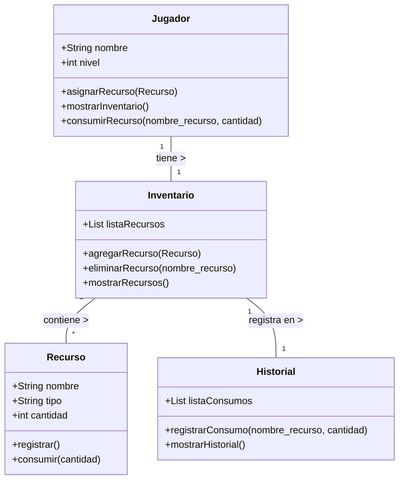
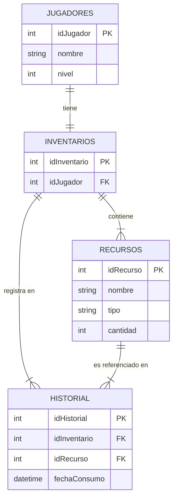

# Gestor de Recursos de Supervivencia

Este proyecto simula un sistema de gestión de recursos en un entorno de supervivencia. El jugador puede registrar medicinas y comida, asignarlas a su inventario y consumirlas según sea necesario. El objetivo es organizar y controlar los recursos de manera eficiente para sobrevivir en escenarios hostiles.

## Requerimientos
- **Funcionales:**
  - Registrar recursos con nombre, tipo y cantidad.
  - Asignar recursos a un jugador.
  - Mostrar inventario actual.
  - Consumir recursos y actualizar cantidades.
  - Eliminar recursos cuando se agotan.
  - Guardar historial de recursos consumidos.
- **No funcionales:**
  - Interfaz sencilla en consola.
  - Compatible con cualquier PC con Python instalado.
  - Código modular y fácil de mantener.

## Diagrama UML de Clases



## Diagrama Entidad-Relación (ER)



## Despliegue

**Requisitos:** Python 3.x instalado.

**Pasos:**
1. Clonar el repositorio desde GitHub o abrir la carpeta en tu entorno.
2. Abrir la carpeta en Visual Studio Code o terminal.
3. Ejecutar el script:
   ```bash
   python supervivencia.py
   ```
4. Interactuar con el sistema desde el menú en la consola.
